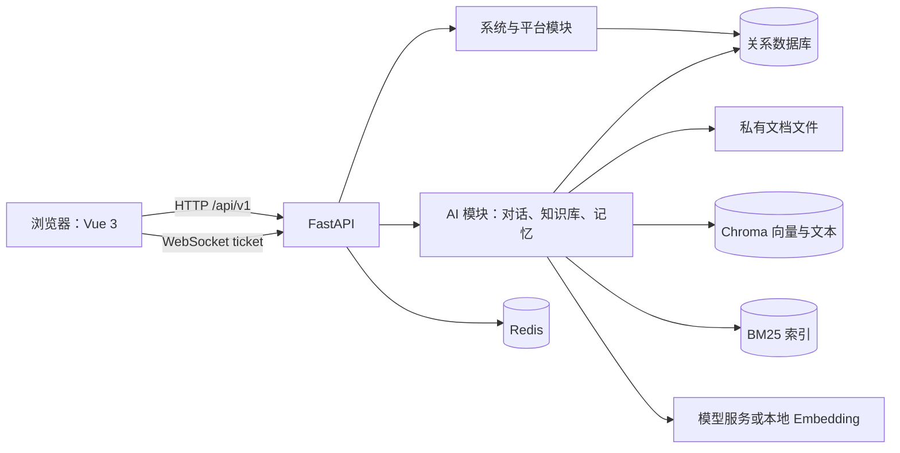

# 架构与开发指南

本文描述当前 `backend/` 与 `frontend/` 的运行链路。实际行为以源码、`backend/pyproject.toml`、`frontend/package.json` 和环境文件为准；历史设计稿与实现总结不作为运行说明。

## 系统概览

FastapiAdmin 是单组织后台。前端负责登录、菜单导航、系统管理和 AI 工作界面；后端负责认证与权限、业务 API、数据初始化及 AI 知识库与对话。正常启动会连接关系数据库和 Redis；知识库还使用本地文件、Chroma 与 BM25 索引，AI 对话使用配置的模型服务。



| 边界 | 代码入口 | 职责 |
| --- | --- | --- |
| 前端启动 | `frontend/src/main.ts`、`src/plugins/index.ts` | 初始化 Pinia、路由、指令、国际化和组件库 |
| 前端鉴权与导航 | `src/store/modules/user.store.ts`、`src/router/` | 登录状态、授权菜单转换、动态路由注册和导航守卫 |
| 后端组装 | `backend/main.py`、`app/init_app.py` | 装配中间件、路由、生命周期和静态文件 |
| 通用后台 API | `app/api/v1/module_common/`、`module_platform/`、`module_system/` | 文件与健康检查、菜单、认证及系统管理 |
| AI 核心模块 | `app/plugin/module_ai/`、`app/core/plugins.py` | 对话、知识库、记忆及模型配置；通过显式清单组装 |
| 数据初始化 | `app/scripts/initialize.py`、`app/scripts/migrate.py` | ORM 建表与种子数据、已有 Alembic 迁移 |

表中 `app/` 和 `src/` 分别相对于 `backend/`、`frontend/`。模块按功能组织；新增功能先沿现有调用链打通完整用例，再决定是否需要拆分更多文件。

## 启动、路由与权限

1. 从 `backend/` 运行 `uv run main.py run --env=dev`。CLI 先设置 `ENVIRONMENT`，再导入配置；`app/config/setting.py` 和 `app/plugin/module_ai/config.py` 读取对应 `backend/env/.env.dev`。
2. `create_app()` 注册异常处理、中间件、通用路由、AI 路由和静态资源。通用路由在 `app/init_app.py:register_routers()` 显式挂载；AI 的 HTTP/WebSocket 路由、模型和启动钩子由 `app/plugin/module_ai/plugin.toml` 声明，交给 `app/core/plugins.py` 装配。当前没有目录扫描式插件发现。
3. 应用生命周期先连接 Redis，再在 Redis 锁下应用已有 Alembic 迁移、按 ORM 创建缺失表并补齐种子数据，随后初始化 AI 模块、参数/字典缓存及限流器。**启动可能修改目标数据库**，先确认环境文件与连接目标。
4. 前端使用 Hash 路由。登录后用户信息中的菜单进入 `MenuProcessor`，由 `menuRoutes.ts` 转换，再经 `RouteRegistry` 校验并注册；`beforeEach.ts` 负责权限与导航。前端隐藏路由不代替后端 `AuthPermission` 校验。

前端 API 请求通过 `frontend/src/utils/http/` 发送。开发代理由 `frontend/vite.config.ts` 配置：`VITE_APP_BASE_API` 是浏览器使用的 API 前缀，`VITE_API_BASE_URL` 是代理目标；WebSocket 另用 `VITE_APP_WS_ENDPOINT`。Vite 会加载 `.env` 和对应模式的 `.env.development`，后者可覆盖同名值。仓库模板与当前开发文件可能不同，联调前以实际加载值和后端监听地址核对。

## 数据归属与知识库链路

| 数据 | 存放位置 | 开发时要确认的事 |
| --- | --- | --- |
| 用户、权限、菜单、知识库元数据、chunk 与状态 | 配置的 MySQL、PostgreSQL 或 SQLite | 数据库目标、迁移与事务；后端测试默认用临时 SQLite |
| 启动锁、缓存、限流与会话相关状态 | Redis | 正常启动需要可访问的 Redis |
| 通用上传与知识库原件 | `backend/storage/upload/`、`backend/storage/knowledge/` | 私有文件与数据库记录的一致性；不要在 API 中暴露服务器绝对路径 |
| 向量与文本块 | `CHROMA_PERSIST_DIR` 指定的 Chroma 目录 | Embedding 模型变化时检查向量维度与集合 |
| 关键词索引 | `BM25_INDEX_DIR` 指定的本地目录 | 与文档重建、删除及检索模式保持一致 |
| 模型调用 | 本地 `fastembed`、配置的对话模型服务或远程 embedding 服务 | 对话模型可选 OpenAI Chat Completions、OpenAI Responses、Anthropic；embedding 单独配置 |

模型配置页可填写模型名，也可使用当前接口地址和 API Key 获取服务商模型列表后选择。获取列表不会保存配置；改用其他接口地址或在 OpenAI 与 Anthropic 之间切换时，保存前需填写对应接口的 API Key。

**真实纵向链路示例：上传知识库文档。**前端 `src/api/module_ai/knowledge.ts` 调用 `POST /ai/knowledge/document/upload`；后端 `knowledge/controller.py` 校验文档创建权限，`knowledge/service.py` 保存原件和元数据，接口返回后由后台任务抽取文本、切块并按 `RETRIEVAL_MODE` 更新 Chroma、BM25 或两者，最后更新索引状态。上传成功只代表文件与记录已接收；应继续检查文档索引状态和检索结果。AI 对话在 `chat/` 中使用知识库检索结果，WebSocket 入口在 `chat/ws.py`，通过 ticket 鉴权。

## 本地开发

工具版本以 `backend/pyproject.toml` 与 `frontend/package.json` 为准：后端 Python 3.12+ 和 `uv`，前端 Node 20.19+ 与仓库声明的 `pnpm`。按所选后端配置准备关系数据库、Redis；使用 AI 对话或远程 embedding 时配置相应模型服务。`uv sync` 已安装 AI 核心依赖，无需额外的 `ai` extra。

```bash
# 在仓库根目录：复制后端模板，先填写本机连接与密钥
cp backend/env/.env.dev.example backend/env/.env.dev

# 终端 1：后端
cd backend
uv sync
uv run main.py run --env=dev

# 终端 2：从仓库根目录启动前端
cd frontend
pnpm install
pnpm dev
```

前端运行前核对已跟踪的 `frontend/.env`、`frontend/.env.development`，尤其是代理与 WebSocket 目标。不要把模板地址、端口或账号当成当前环境的真实值。后端 `--env=dev` 读取 `backend/env/.env.dev`；本地配置和密钥不得提交。

### 常用验证

以下命令分别在对应子目录运行，按改动范围选择；它们本身不构成跨层功能的端到端验收。

```bash
# backend/
uv run pytest tests/test_api_module_ai.py -q
uv run pytest tests/plugin/module_ai -q
uv run ruff check app tests --no-fix --output-format concise

# frontend/
pnpm test
pnpm type-check
pnpm build
```

`backend/tests/conftest.py` 将数据库切到临时 SQLite，并模拟 Redis、限流器等；测试通过不能证明 MySQL/Redis、浏览器或外部模型的运行行为。`pnpm lint` 中的 ESLint、Prettier、Stylelint 脚本会修复或重写文件，仅在需要格式化且已检查工作区差异时运行。

跨层功能至少选择一个可重复的用户场景，验证真实登录与权限、浏览器操作、API 响应、持久化结果及错误态。例如知识库链路要等后台索引完成，再检查文档状态和实际召回；只看到上传接口成功不足以验收检索功能。

## 修改功能的路径

- **系统 API**：从 `app/api/v1/module_*/<feature>/` 的 controller 进入，核对 service、数据访问、权限码与功能组 router；前端对应 `src/api/`、`src/views/` 和后端菜单。
- **AI 能力**：先核对 `module_ai/plugin.toml` 的声明和现有 `chat/`、`knowledge/`、`memory/` 边界。跨功能调用依赖拥有方的公开用例，避免直接耦合对方内部 CRUD、索引或 Provider Client。
- **前端页面**：核对用户菜单的 `route_path`、`route_name`、组件路径、`MenuProcessor`、`RouteRegistry` 与守卫；同时验证后端授权。
- **数据库模型**：Alembic `script_location` 是 `backend/app/alembic`，版本目录为 `backend/app/alembic/versions/`。生成迁移后审查脚本和数据影响；启动只会应用已有迁移，不会替你生成迁移。需要交付的版本文件应与代码一起纳入版本管理。

变更文档时，以代码入口、包脚本和环境模板为事实来源。入口总览放在根 `README.md`；子项目 README 只保留本子项目的操作说明；本文维护跨端调用链和验收边界。历史实现报告与设计稿保留其原始时间语境，不作为当前开发命令的依据。
